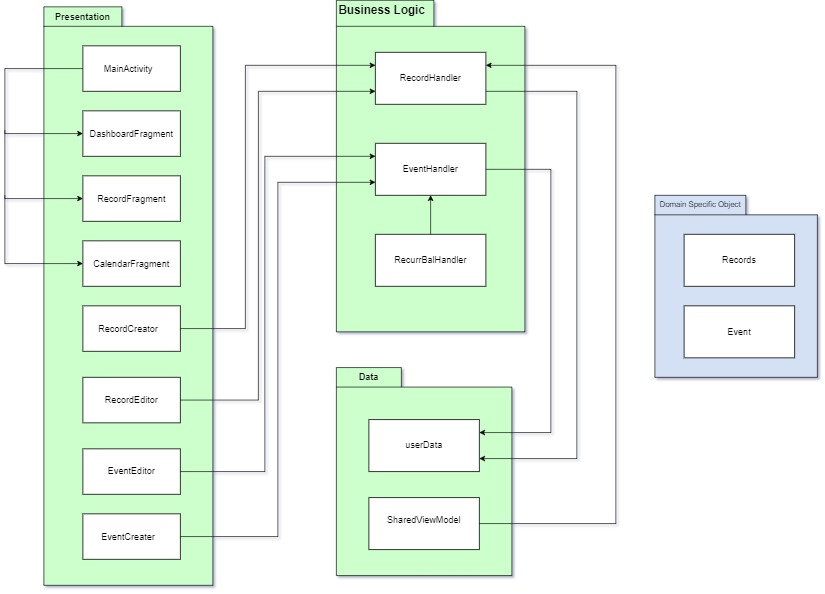
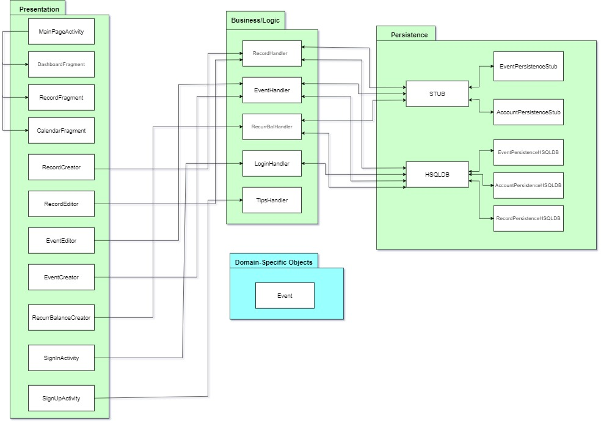

# Architecture 

**We have used the 3-tier architecture to implement our project**

## Sketch: 
 
### Iteration 1

### Iteration 2 and 3

## Description:

### Presentation Layer 

* MainActivity: This file is responsible for the starting screen of the app.

* DashboardFragment: This file manages the user’s dashboard.

* RecordFragment: This file displays the user’s income and expense records.

* CalendarFragment: This file is for calendar view.

* RecordCreater: This file is used to create new records.

* RecordEditor: This file is used to edit the user’s records.

* EventEditor: This file is used to edit events.

* EventCreate: This file is used to create new events.

* RecurrBalanceCreater : This file is used to save recurring balances. 

* SignInActivity : This file is used to handle sign in page. 

* SignUpActivity : This file is used to create a new user. 

### Logic Layer

* RecordHandler: Responsible for keeping track of Income and Expenses of users. 

* EventHandler: Responsible for adding, removing, and querying events within the application.

* RecurrBalHandler: Reponsible for managing user's recurring balance. 

* TipHandler : Reponsible for showing the tip to users. 

* LoginHandler : Reponsible for login activity. 

### Persistence Layer 

* HSQLDB 

    * AccountPersistenceHSQLDB : This file will deal with user account table. 

    * EventPersistenceHSQLDB : This file will deal with the events table.

    * PersistenceException : This is the exception created to show the error from persistence layer. 

    * RecordPersistenceHSQLDB : This is the file will deal with record tables. 

* Stub 

    * AccountPersistenceStub : This file will create a stub for user accounts.

    * EventPersistenceStub : This file will create a stub for events. 

### Domain Specific Object 

* Event: Object to manipulate event data.
