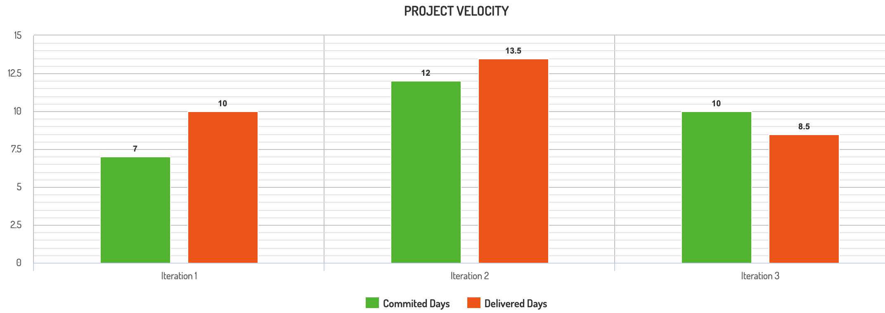

# MoneyFlow Retrospective 

## What Went Wrong?

One significant challenge we encountered throughout the development of MoneyFlow was inadequate testing coverage, which impacted the overall development speed. In previous iterations, we received lower marks primarily due to this. Upon reflection, we identified the root cause as our inability to estimate accurately the time needed to implement features and user stories. This inadequate time estimation led to the accumulation of technical debt for every iteration that required refactoring efforts and thus hindered proper testing implementation.

We have created an approach to rectify this issue to enhance our testing process and mitigate technical debt. Firstly, we are placing a greater emphasis on writing efficient and comprehensible code from the outset of each development cycle. Unlike previous iterations, this proactive measure minimizes technical debt accumulation, facilitating smoother testing.Moreover, we recognize the importance of allocating sufficient time for testing activities. In the upcoming iteration, we have restructured our time estimates to ensure that every feature undergoes thorough testing before release. By adopting this approach, we aim to achieve comprehensive test coverage and identify potential issues early in the development, ultimately delivering a more robust and stable product to our users. 

Finally, we had high expectations for our project, and we wanted to connect banking application APIs that can allow users to sync their data with their bank. Unfortunately, we could not implement it due to the limited time we had and the technical debt mentioned previously. Thus showing the team the importance of proper time estimation

In conclusion, while we encountered setbacks in testing coverage during previous iterations, we are committed to continuous improvement. By prioritizing code quality, dedicating sufficient time to testing, and refining our time estimation processes, we can overcome these challenges and deliver a superior product experience for our users.

## How can we improve this iteration?

Our Team discussed the potential ways we can improve and evaluate ourselves this iteration and we came up with the following:

1. Change the time estimates for the features to be implemented this iteration and hope to deliver it within one day early or late.
2. Refactor Methods at the start of the iteration to ensure of technical debt is reduced and we can consider it an improvement if testing was delivered earlier than expected
3. Have two people from the team to be dedicated for code review to avoid merge conflicts and/or merging inadequate code 

All of this can help us improve our work for this iteration and make us deliver a better product for our users!!

## Project Velocity Chart from Previous Iterations 

